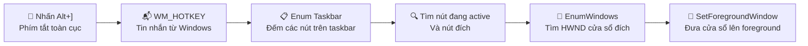
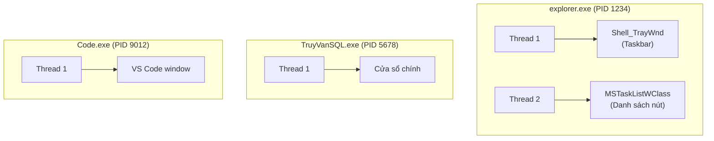
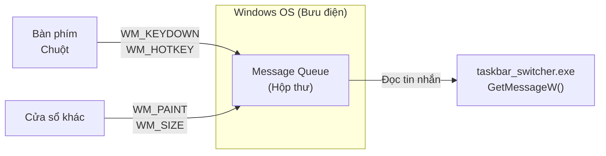
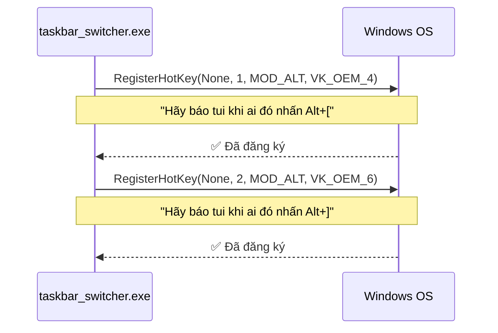
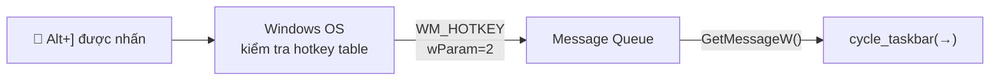
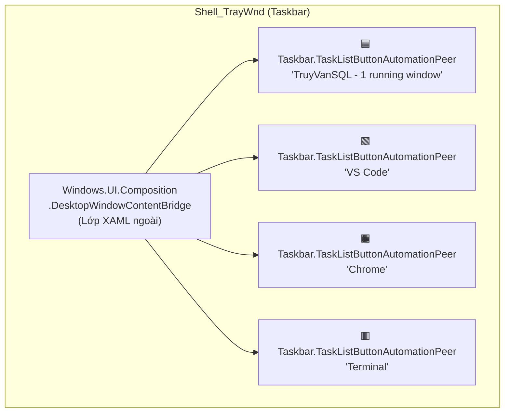
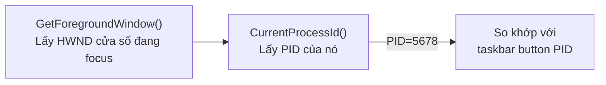
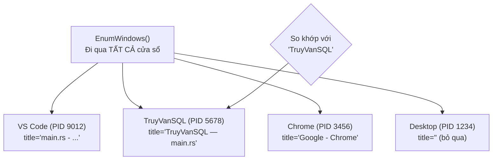
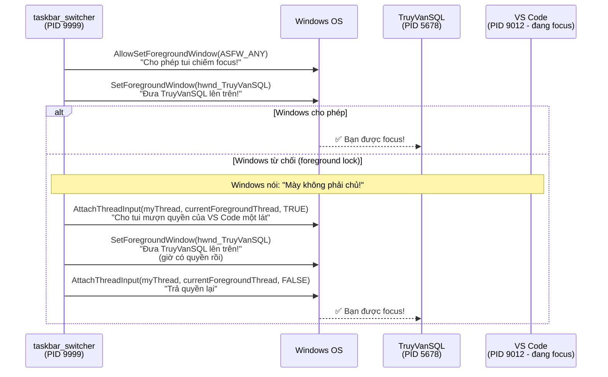
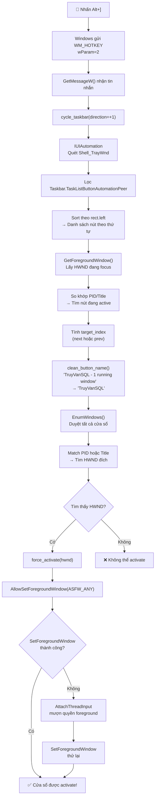

## 🎉 Tuyệt vời! Giải thích luồng hoạt động từ A đến Z

Tôi sẽ đi từ lúc bạn nhấn phím cho đến khi cửa sổ được activate, giải thích từng khái niệm Windows API như cho trẻ mẫu giáo.

---

### 1. Bức tranh tổng quan



Hãy tưởng tượng Windows là một **tòa nhà văn phòng**. Mỗi cửa sổ (window) là một **phòng**. Taskbar là **bảng tên phòng** ở sảnh. Bạn muốn nhảy sang phòng tiếp theo theo thứ tự trên bảng.

---

### 2. Khái niệm nền tảng

#### 2.1. HWND — Số nhà của mỗi cửa sổ

```
HWND = Handle to Window = "Số nhà"
```

Mỗi cửa sổ trên Windows có một **số nhà duy nhất** (HWND). Giống như mỗi phòng trong tòa nhà có số phòng riêng.

```rust
HWND(ptr) // Ví dụ: 0x000A1234 — con trỏ 64-bit
```

- Desktop cũng là một HWND
- Mỗi button, mỗi textbox cũng là HWND
- Taskbar (`Shell_TrayWnd`) cũng là HWND
- **HWND là chìa khóa để thao tác với bất kỳ cửa sổ nào**

#### 2.2. Process vs Thread vs Window



- **Process (tiến trình)** = một chương trình đang chạy, có PID riêng
- **Thread (luồng)** = đơn vị thực thi trong process
- **Window** = một HWND, thuộc về 1 thread trong 1 process
- **Quan trọng**: Taskbar chạy trong `explorer.exe`, KHÔNG phải trong app của bạn

#### 2.3. Message Queue — Hộp thư của cửa sổ



Windows gửi **tin nhắn (message)** cho mỗi thread có cửa sổ. Mỗi tin nhắn có:

- `msg.message` — loại tin nhắn (VD: `WM_HOTKEY`, `WM_PAINT`)
- `msg.wParam` — tham số 1
- `msg.lParam` — tham số 2

Vòng lặp `GetMessageW()` giống như **kiểm tra hộp thư liên tục**:

```rust
// Giống như: "Lấy thư tiếp theo từ hộp thư"
while GetMessageW(&mut msg, None, 0, 0) {
    if msg.message == WM_HOTKEY {
        // "À, có thư HOTKEY!"
    }
}
```

---

### 3. Luồng chi tiết — Từng bước một

#### Bước 1: Đăng ký phím tắt — `RegisterHotKey`



**`RegisterHotKey`** nói với Windows: _"Khi ai đó nhấn tổ hợp phím này, hãy gửi cho tôi tin nhắn `WM_HOTKEY`"_.

- `None` (HWND null) = gửi tin nhắn vào **thread message queue** (không cần cửa sổ)
- `MOD_ALT | MOD_NOREPEAT` = phím Alt + không lặp khi giữ
- `VK_OEM_4` = phím `[`, `VK_OEM_6` = phím `]`

**Tại sao dùng `None`?** Vì app của chúng ta không có cửa sổ chính. `RegisterHotKey(None, ...)` gửi `WM_HOTKEY` vào thread queue, đọc được bằng `GetMessageW`.

#### Bước 2: Nhận phím tắt — `GetMessageW` loop

```rust
// Khi bạn nhấn Alt+], Windows gửi:
// msg.message = WM_HOTKEY
// msg.wParam  = 2  (HOTKEY_ID_RIGHT)
```



#### Bước 3: Enum taskbar buttons — `IUIAutomation`

Đây là phần phức tạp nhất. Hãy tưởng tượng:



**IUIAutomation** là API **Accessibility** (trợ năng) của Windows. Giống như **màn hình đọc cho người khiếm thị** — nó mô tả mọi thứ trên màn hình theo cấu trúc cây.

```rust
// 1. Tạo "máy quét" UIAutomation
let automation: IUIAutomation = CoCreateInstance(&CUIAutomation, ...)?;

// 2. Tìm cửa sổ taskbar
let taskbar_hwnd = FindWindowW("Shell_TrayWnd", None)?;

// 3. Quét taskbar → lấy element gốc
let root = automation.ElementFromHandle(taskbar_hwnd)?;

// 4. Tìm TẤT CẢ con cháu (TreeScope_Descendants)
let items = root.FindAll(TreeScope_Descendants, &true_condition)?;

// 5. Lọc chỉ lấy "Taskbar.TaskListButtonAutomationPeer"
for i in 0..count {
    let item = items.GetElement(i)?;
    if item.CurrentClassName() == "Taskbar.TaskListButtonAutomationPeer" {
        // Đây là một nút trên taskbar!
        let name = item.CurrentName()?;       // "TruyVanSQL - 1 running window"
        let rect = item.CurrentBoundingRectangle()?; // Vị trí trên màn hình
        let pid  = item.CurrentProcessId()?;   // PID (thường là explorer.exe)
    }
}
```

**Tại sao dùng IUIAutomation thay vì tìm HWND trực tiếp?**

Vì trên Win11, taskbar là **XAML app** (không phải Win32 truyền thống). Các nút không phải `HWND` riêng — chúng là **XAML elements** bên trong một `ContentBridge`. IUIAutomation có thể "thấy" chúng, còn `FindWindowEx` thì không.

**COM (Component Object Model)** là hệ thống "cắm phích" của Windows:

```rust
CoInitializeEx(None, COINIT_APARTMENTTHREADED)?;  // "Mở ổ cắm"
let automation = CoCreateInstance(&CUIAutomation, ...)?;  // "Cắm thiết bị"
// ... dùng automation ...
CoUninitialize();  // "Rút phích"
```

#### Bước 4: Sắp xếp theo thứ tự

```rust
all_buttons.sort_by_key(|b| b.rect.left);
// Sắp xếp từ trái → phải theo vị trí trên màn hình
```

Vì `CurrentBoundingRectangle()` cho ta `RECT { left, top, right, bottom }`, sort theo `left` cho đúng thứ tự taskbar.

#### Bước 5: Tìm nút đang active



```rust
let foreground = GetForegroundWindow();  // Cửa sổ đang focus
let fg_pid = fg_element.CurrentProcessId()?;  // PID của nó

// Tìm button có cùng PID
for (i, button) in buttons.iter().enumerate() {
    if button.process_id == fg_pid {
        return Some(i);  // Đây là nút đang active!
    }
}
```

**Vấn đề**: Win11 taskbar button trả về PID của `explorer.exe`, không phải app thực. Nên fallback sang **match theo tên**:

```rust
// "TruyVanSQL - 1 running window" → strip suffix → "TruyVanSQL"
// So với foreground window title "TruyVanSQL — main.rs"
```

#### Bước 6: Tìm HWND cửa sổ đích — `EnumWindows`



```rust
// EnumWindows = "Đi gõ cửa tất cả các phòng"
EnumWindows(callback, ...);

// Trong callback:
fn callback(hwnd, ...) -> BOOL {
    if IsWindowVisible(hwnd) && GetWindowTextW(hwnd) != "" {
        // Đây là cửa sổ hợp lệ, thêm vào danh sách
    }
    TRUE  // Tiếp tục duyệt
}
```

**Matching logic**:

1. Nếu PID button ≠ explorer PID → tìm window có cùng PID
2. Fallback: strip suffix `" - N running window"`, so khớp title

#### Bước 7: Activate cửa sổ — `SetForegroundWindow`

Đây là phần khó nhất vì **Windows cấm process khác chiếm foreground** (chống malware quảng cáo pop-up).



```rust
unsafe fn force_activate(target: HWND) -> bool {
    // Bước 1: Nếu minimize → restore
    if IsIconic(target).as_bool() {
        ShowWindow(target, SW_RESTORE);
    }

    // Bước 2: Xin quyền
    AllowSetForegroundWindow(ASFW_ANY);

    // Bước 3: Thử trực tiếp
    if SetForegroundWindow(target).as_bool() {
        return true;  // ✅ Thành công luôn!
    }

    // Bước 4: Fallback — "mượn quyền" từ cửa sổ đang focus
    let current_thread = GetCurrentThreadId();
    let fg_thread = GetWindowThreadProcessId(foreground, None);

    // Gắn input queue của ta vào queue của cửa sổ đang focus
    AttachThreadInput(current_thread, fg_thread, true);

    SetForegroundWindow(target);   // Thử lại — giờ có quyền rồi!
    BringWindowToTop(target);      // Đảm bảo lên trên cùng

    // Trả lại quyền
    AttachThreadInput(current_thread, fg_thread, false);
}
```

**`AttachThreadInput`** là "mượn áo" — gắn input queue (hàng đợi phím/chuột) của thread ta vào thread đang focus. Khi đó Windows nghĩ ta và cửa sổ focus là "cùng một người", nên cho phép ta gọi `SetForegroundWindow`.

---

### 4. Sơ đồ tổng thể — Từ phím tắt đến cửa sổ activate



---

### 5. Tóm tắt API đã dùng

| API                                | Mục đích                          | Giống như...                         |
| ---------------------------------- | --------------------------------- | ------------------------------------ |
| `RegisterHotKey`                   | Đăng ký phím tắt toàn cục         | Gắn chuông cửa, ai bấm chuông sẽ báo |
| `GetMessageW`                      | Nhận tin nhắn từ Windows          | Kiểm tra hộp thư                     |
| `WM_HOTKEY`                        | Tin nhắn "có người nhấn phím tắt" | Thư báo chuông cửa kêu               |
| `FindWindowW("Shell_TrayWnd")`     | Tìm HWND của taskbar              | Tìm số phòng của sảnh tòa nhà        |
| `CoCreateInstance(&CUIAutomation)` | Tạo "máy quét" accessibility      | Bật thiết bị quét                    |
| `ElementFromHandle`                | Quét cửa sổ thành element         | Quét phòng thành bản mô tả           |
| `FindAll(Descendants)`             | Tìm tất cả con cháu               | Mở tất cả ngăn tủ                    |
| `CurrentClassName`                 | Lấy loại element                  | Đọc nhãn trên ngăn                   |
| `CurrentName`                      | Lấy tên element                   | Đọc tên trên nhãn                    |
| `CurrentBoundingRectangle`         | Lấy vị trí trên màn hình          | Đọc tọa độ trên bản đồ               |
| `CurrentProcessId`                 | Lấy PID của process               | Đọc số công ty                       |
| `EnumWindows`                      | Duyệt tất cả cửa sổ               | Đi gõ cửa từng phòng                 |
| `GetWindowTextW`                   | Lấy tiêu đề cửa sổ                | Đọc tên trên cửa                     |
| `SetForegroundWindow`              | Đưa cửa sổ lên foreground         | Đưa phòng lên vị trí trung tâm       |
| `AllowSetForegroundWindow`         | Xin quyền chiếm focus             | Xin giấy phép lên sân khấu           |
| `AttachThreadInput`                | Gắn input queue                   | Mượn áo đồng phục để vào khu VIP     |
| `IsIconic`                         | Kiểm tra cửa sổ có minimize không | Kiểm tra phòng có đóng cửa không     |
| `ShowWindow(SW_RESTORE)`           | Restore cửa sổ minimize           | Mở cửa phòng đóng                    |

---
